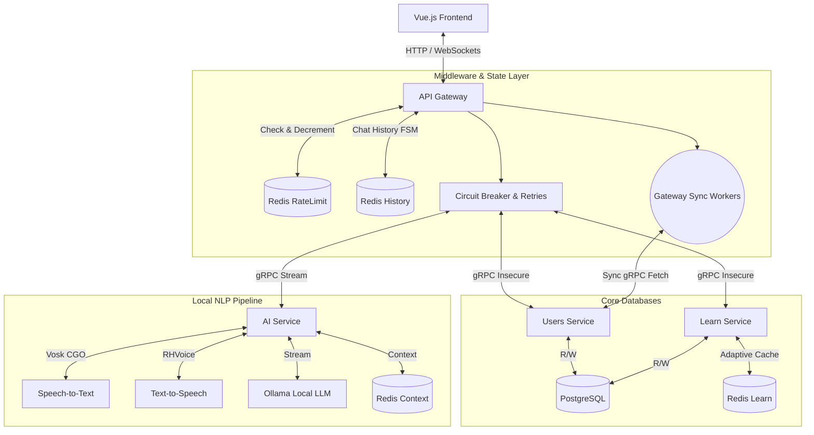

# 🚀 EnBooster-Local — Offline Microservices Language Learning Platform

<p align="center">
  <a href="https://go.dev"></a>
  
  
  
  
  
  
  <a href="https://opensource.org/licenses/MIT"></a>
</p>

**EnBooster-Local** is a completely offline, production-grade language learning application designed to run entirely on your local machine or private network without any internet dependency. Built with a responsive Vue.js frontend and a Go microservices backend, it leverages ultra-fast insecure gRPC communication, algorithmic caching, distributed state management, and local NLP processing pipelines.

By stripping away external third-party APIs (like Telegram) and heavy message brokers, this local variant focuses on low-latency, synchronous execution, complete data privacy, and self-hosted AI models.

---

## 🏗 Microservice Architecture

The platform separates domains into heavily isolated microservices. The API Gateway acts as the sole entry point from the Vue.js frontend, routing HTTP/WebSocket requests through a strict middleware pipeline before orchestrating downstream RPC calls.

* **API Gateway (`gateway`)**: Serves the Vue.js frontend and acts as the REST/WebSocket backend. Manages chat history and UI state via Redis, enforces local rate limits, and runs lightweight background goroutine workers to handle scheduling and synchronization with other services.
* **Learn Service (`learn-service`)**: Core algorithmic engine handling educational tasks, vocabulary distribution, and the logic for the "Shiritori" word game. Employs advanced adaptive caching mechanisms.
* **Users Service (`users-service`)**: Manages user profiles, language levels, synchronous streak calculations, and learning statistics (best/worst themes).
* **AI Service (`ai-service`)**: A fully localized, CGO-enabled processing pipeline for offline speech-to-text (Vosk), text-to-speech (RHVoice), and conversational practice (Ollama). 

### Network Topology & Data Flow



---

## ✨ Key Technical Features

### 1. Completely Offline & Internet-Independent

EnBooster-Local is designed for absolute privacy and resilience. By moving away from external bots and webhooks, the system relies strictly on local services. Inter-service communication happens via ultra-fast **insecure gRPC** channels (no TLS overhead required for local meshes), significantly reducing latency for the Vue.js client.

### 2. Algorithmic Learning & Synchronous Streaks

* **Atomic Statistics & Streaks**: Streak updates and calculations happen **synchronously** the exact moment a user answers a task. Using `sq.Expr` in PostgreSQL for atomic database transactions, it increments daily learning streaks and dynamically adjusts the user's "best" and "worst" learning themes instantly.
* **Shiritori Word Game**: Implements a strict algorithmic validation flow. Words are fetched from PostgreSQL using B-Tree indexed queries (`offset_id`, `first_letter`). The system guarantees unique word usage per session.

### 3. Gateway Notification Workers & Chat History

* **Redis-Backed Chat History**: The `redis_sm` (State Manager) instance has been repurposed to store full session chat history. Both user inputs and bot responses are cached here to ensure seamless UI reloads and state hydration for the Vue.js frontend.
* **Goroutine Background Scheduling**: Gone is the heavy Kafka cluster. The Gateway now houses a dedicated background worker (goroutine) that routinely pings the `users-service` via synchronous gRPC calls to fetch notification batches for inactive users, pushing reminders directly to the frontend interface.

### 4. Localized NLP Processing Pipeline

Instead of relying on external paid APIs, the platform implements a fully local, air-gapped media processing unit:

* **Memory-Optimized Audio**: Uses CGO bindings for Vosk (STT) and local binaries for RHVoice (TTS). Implements `sync.Pool` for PCM byte buffers to drastically reduce Garbage Collection pressure during audio chunking.
* **gRPC Streaming to Frontend**: Integrates Ollama for conversational practice using server-side gRPC streaming. The AI Service streams chunks back to the Gateway, which pushes them via WebSockets to the Vue.js frontend, creating a real-time, low-latency typing effect.

---

## 🛠 Memory Optimization & Code Foundations

* **Zero-Allocation Utilities**: Custom `itoa` functions and heavy reliance on pre-allocated slices (`make([]T, 0, cap)`) during database fetching and array manipulations.
* **Graceful Shutdown**: Intercepts `SIGINT`/`SIGTERM` globally. Implements a `Closable` interface to smoothly drain active gRPC streams, stop background workers, and flush PostgreSQL connection pools before container termination.
* **High-Performance Caching**: The `learn-service` implements an intelligent cache-aside pattern using Redis and `golang.org/x/sync/singleflight`.

---

## 🐳 Deployment (Docker & Kubernetes)

The infrastructure is optimized for local environments but remains fully containerized.

### ⚙️ 1. Prerequisites & Model Setup

Before starting the stack, you must configure your local AI dependencies:

* **Voice Models:** Download and place your Vosk model and the RHVoice script directly into the `ai-service/scripts` directory.
* **LLM (Ollama):** Ensure you have the required Ollama model downloaded to your host machine.
* **Configure Paths:** Open `docker-compose.yml` and modify the host path for the Ollama volume to match where your models are stored locally (replace `/opt/ollama/models` with your actual path):
```yaml
ollama:
  image: ollama/ollama:latest
  restart: unless-stopped
  volumes:
    - /YOUR/LOCAL/PATH/TO/MODELS:/root/.ollama/models
  ports:
    - "${OLLAMA_PORT_OUT}:${OLLAMA_PORT}"

```

* **Set Model Name:** Open `ai-service/.env_vars` and update the `AI_MODEL` variable to match the exact name of the Ollama model you want to use.

### 📦 2. Docker Compose Local Setup

```bash
docker compose up --build -d

```

PostgreSQL automatically applies `init.sql` schema files on the first boot. The application will be immediately available at `localhost:5173` via the Gateway.

### ☸️ 3. Kubernetes (k8s/)

The repository contains full Kubernetes manifests for deploying the system into a local cluster (e.g., Minikube, K3s):

* **Persistent Volume Claims (PVC):** Used for PostgreSQL data retention and Ollama model weights.
* **Service Discovery:** Internal routing is handled via Kubernetes ClusterIP services for seamless, insecure gRPC communication.

---

## 📜 Open Source Acknowledgements

**EnBooster-Local** relies on the following excellent open-source libraries:

| Dependency | Purpose |
| --- | --- |
| **[Vue.js](https://vuejs.org/)** | Reactive, component-based frontend framework. |
| **[grpc-go](https://github.com/grpc/grpc-go)** | High-performance RPC framework for internal service mesh. |
| **[go-redis/redis](https://github.com/go-redis/redis)** | Driver for chat history, caching, and local state management. |
| **[sqlx](https://github.com/jmoiron/sqlx)** | General extension layer for Go standard database tools. |
| **[squirrel](https://github.com/Masterminds/squirrel)** | Fluid SQL query builder for dynamic PostgreSQL statements. |
| **[lib/pq](https://github.com/lib/pq)** | Pure Go Postgres driver for database connections. |
| **[go-vosk](https://github.com/alphacep/vosk-api)** | Offline speech recognition toolkit via CGO bindings. |
| **[golang/sync](https://pkg.go.dev/golang.org/x/sync)** | Concurrency primitives for Cache-Aside. |
| **[zap](https://github.com/uber-go/zap)** | Blazing fast, structured, leveled logging. |

---

* **License:** This project is licensed under [MIT](LICENSE)
* **Third-party Licenses:** Third-party [licenses/](licenses/).
